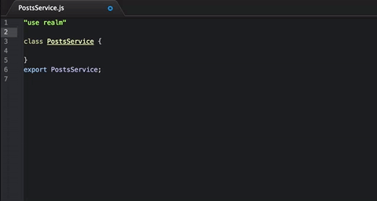

# Realm-js

Imagine js imports on steroids! *Realm-js* respects promises, super fast as transpiling, supports aliases and runs in an isolated universal environment.




# Features
   * 100% Universal
   * Improved import system - Packages, aliases
   * Promise based
   * EC7 friendly - decorators
   * Automatic environment separation (backend, frontend, universal)
   * Backend encapsulation / Bridges
   * Extremely fast compilation (50-70ms) to transpile a big project

## Usage

```js
"use realm";

import FeedParser, GoogleFeed from app.blogs;

class Application {
   static main() {
      GoogleFeed.getFeed("Official Google Blogs").then(function(entries) {
         var entries = FeedParser.getEntries(entries);
         console.log(entries);
      });
   }
}
export Application;
```


[Medium Post](https://medium.com/@ivanorlov/universal-bridging-1e3a08015a44)
## Try it now!

```bash
git clone https://github.com/realm-js/universal-app-example
npm install
cd universal-app-example
gulp start
```
ToDo service is isolated. Frontend can access the interface, however code  is hidden from the end users.

</body>
## Header types

Univeral mode. File will be put into universal.js
```js
"use realm";
```

Frontend mode. File will be put into frontend.js
```js
"use realm frontend";
```

Frontend mode without wrapping. File will be put into frontend.js
```js
"use realm frontend-raw";
```


Backend mode. File will be put into backend.js
```js
"use realm backend";
```

Backend mode without wrapping. File will be put into backend.js
```js
"use realm backend-raw";
```

Bridge mode, the source will be put into backend.js, interface into frontend.js
```js
"use realm bridge";
```

## Using Bridges
Sometimes you need to have your code encapsulated. Say, secured calls involving authentication;
In this case, bridge is the most suitable case.

Before proceeding, you need to install realm-router (it will actually proxy frontend requests)
Set up you express application like so:

```js
var router = require("realm-router");
realm.require('realm.router.Express', function(router) {
   app.use(router(["realm.router.bridge"]))
})
```

Include realm-router frontend build file into your html file. And start bridging!

```js
"use realm bridge";
class Auth {
   static login()
   {

   }
}
export Auth
```
Remember that only static methods are exposed.


## Transpiler
Universal transpiler will output 3 files: backend, frontend, universal
```js
gulp.task('build-universal', function() {
   return realm.transpiler2.universal(__dirname + "/test-universal/", "test_build/").then(function(changes) {
      console.log(changes)
   })
});
```


### Install
```
npm install realm-js --save
```

## Under the hood

You can use realm-js without transpiler
### Creating modules/services
```js
realm.module("MyFirstModule", function() {
   return new Promise(function(resolve, reject){
      return resolve({hello : "world"})
   });
});
realm.module("MySecondModule", function(MyFirstModule) {
   console.log(MyFirstModule);
});
```

### Require a module
Code:
```js
realm.require(function(MySecondModule){
   console.log(MySecondModule)
});
```

Will resolve all required dependencies. The ouput:
```js
{hello: "world"}
```

### Require a package
You can require a package if you like.

```js
realm.requirePackage("app.components").then(function(components){

});
```

### Annotation
Clearly, if you don't use ec6, or any other transpilers, you need to annotate modules
```js
realm.module("myModule", ["moduleA", "moduleB"], function(moduleA, moduleB){

})
```


### A simple import
If a module does not belong to any package:
```js
import Module
```

If a module belongs to a package:
```js
import Module from app
```

Giving it alias
```js
import Module as mod from app
```

Explicit module name (not recommended)
```js
```


## Dealing with promises

Realm-js has a set of functionality that helps solving many problems or impediments related to Promises

### Each
Iterates a list of promises (objects) consecutively. Respects promises if provided
```js
var a = [1, 2, 3];
realm.each(a, function(num){
  return new Promise((resolve, reject) => {
    setTimeout(function(){
      return resolve(num++)
    }, num);
  })
}).then(function(result){
   // [2,3,4]
});
```

And another example with optional Promise
```js
realm.each(a, function(num){
  if( num ===3) {
    return new Promise((resolve, reject) => {
      setTimeout(function(){
        return resolve("gotcha")
      }, 1);
    })
  }
  return num;
}).then(function(result){
  // [1, 2, "gotcha"]
})
```

### Chains

Chain are very helpful when you have a logic flow, and you need to split it up, and keep you code clean.
All methods are executed in strict order. You can call it a waterfall. 
```js
class MyChain {
   
   setFoo() {
      // I am the first one. And i set this.foo = "foo1"
      return "foo1";
   }
   setBar() {
      // I am the second one, and i have "this.foo" at my disposal
      // And i set this.bar = "bar1"
      return "bar1";
   }
   justSomethingFunky()
   {
     // I am the third one, and everyone will wait for me
     let self = this;
     return new Promise(function(resolve, reject){
        // But i will not assign anything
        // Just have to resolve myself
        return resolve(self.bar)
     })
   }
   setHello()
   {
      // I am the last to be executed, and i will assign this.hello = "world"
      return "world";
   }
}
realm.chain(MyChain).then(function(result){
   // {foo : "foo1", bar : "bar1", hello: "world" }   
});
```

Executes methods in defined order. If a setter is defined, realm will assign the result into the instance of a class.

You can format the output as well
```js
class MyChain {
   setFoo() {
      return "foo1";
   }
   setBar() {
      // I am still executed
      return "bar1";
   }
   format()
   {
      return {
        hello : this.foo
      }
   }
}
realm.chain(MyChain).then(function(result){
     // {hello : "foo1" }   
});
```
## Contribute
Please, contribute!
